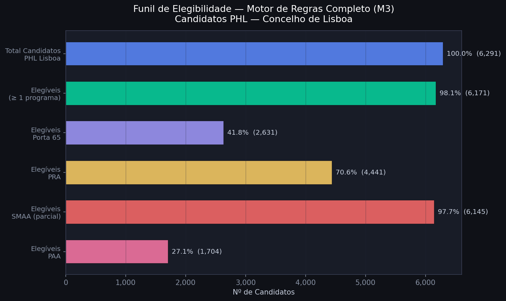

# Desafio Habitação Lisboa: Análise de Elegibilidade aos Programas de Apoio

## Identificação da Equipa
* **Grupo nº:** 2
* **Membros:**
  * Afonso Nunes - 2023141213
  * Duarte Ribeiro - 2023142440
  * Guilherme Ventura - 2023132296

---

## Organização do Portfólio de Resultados

Este repositório funciona como uma **Wiki de Projeto**, documentando as decisões e resultados sem exposição de dados sensíveis ou código proprietário:

* **`milestones/`** — Documentação técnica detalhada de cada etapa do projeto
* **`assets/graficos/`** — Evidências visuais: gráficos EDA, resultados do modelo, funil de elegibilidade
* **`.gitignore`** — Filtro de segurança que impede submissão de dados brutos ou scripts

---

## 1. Iniciação (Milestone 1)

### Questão de Investigação

> *"Desenvolver um modelo de classificação supervisionado que, utilizando os dados socioeconómicos da Plataforma Habitar Lisboa, seja capaz de prever a elegibilidade dos candidatos aos programas municipais com um F1-Score superior a 80%, identificando simultaneamente a importância das variáveis na exclusão dos candidatos."*

### Contexto e Problema

A crise habitacional em Lisboa levanta uma questão crítica: quantos candidatos registados na Plataforma Habitar Lisboa são formalmente elegíveis para os programas de apoio existentes? O projeto analisa dados reais da plataforma municipal e cruza os perfis socioeconómicos com os critérios legais de elegibilidade de 4 programas (Porta 65 Jovem, PRA, SMAA e PAA).

👉 **[Documentação completa — Milestone 1](milestones/M1_iniciacao.md)**

---

## 2. Exploração (Milestone 2)

### Principais Conclusões (EDA)

* **Rendimento médio candidatos PHL (Lisboa):** 16.376 €/ano (mediana: 13.818 €)
* **Rendimento médio beneficiários reais:** SMAA 16.511€ | PRA 17.157€ | PAA 3.065€
* **61%** dos candidatos residem no concelho de Lisboa (6.291 de 10.279)
* **77.6%** dos agregados têm 1–2 pessoas
* Os perfis socioeconómicos de candidatos e beneficiários são **estatisticamente semelhantes** — a exclusão não é por falta de adequação do perfil

👉 **[Documentação completa — Milestone 2](milestones/M2_exploracao.md)**

---

## 3. Modelação (Milestone 3)

### Motor de Regras + Machine Learning

#### Taxa de Cobertura Formal

| Programa | Elegíveis | % Candidatos |
|:---|:---:|:---:|
| Porta 65 Jovem | 2.631 | 41.8% |
| PRA — Renda Acessível | 4.441 | 70.6% |
| SMAA (limite superior) | 6.145 | 97.7% |
| PAA — Arrendamento Apoiado | 1.704 | 27.1% |
| **Elegíveis em ≥ 1 programa** | **6.171** | **98.1%** |

#### Modelo de Machine Learning (Árvore de Decisão)

| Métrica | Resultado |
|:---|:---:|
| Accuracy (teste 20%) | 99.2% |
| F1-score | 99.6% |
| Recall (elegíveis) | 99.6% |
| Feature importance: rendimento | 93.9% |

A árvore de decisão, sem acesso à legislação, convergiu automaticamente para os mesmos limiares que a lei define (35.000€ e 45.000€).

👉 **[Documentação completa — Milestone 3](milestones/M3_modelacao.md)**

---

## 4. Finalização (Milestone 4)

### Resposta ao Problema

**A taxa de cobertura formal é de 98.1%.** Quase todos os candidatos PHL satisfazem os critérios de rendimento e idade dos programas existentes. A exclusão real não é causada por falta de elegibilidade formal — é causada por **critérios não observáveis e pela capacidade finita dos programas** (oferta insuficiente face à procura).

O funil burocrático não opera ao nível da triagem formal. Opera ao nível da **seleção entre elegíveis**.

### Recomendações

1. Aumentar a oferta habitacional disponível nos programas — não restringir os critérios
2. Priorizar o SMAA e o PRA, que cobrem a maior parte dos candidatos de classe média
3. Monitorizar a taxa de esforço real dos candidatos para melhorar a triagem SMAA

👉 **[Documentação completa — Milestone 4](milestones/M4_finalizacao.md)** *(em curso)*

---

**Instituição:** Coimbra Business School | ISCAC
**Curso:** Licenciatura em Ciência de Dados para a Gestão
**Unidade Curricular:** Projeto em Ciência de Dados
**Professor Responsável:** Dora Melo (dmelo@iscac.pt)

---

## Nota de Confidencialidade

Este repositório contém exclusivamente documentação de resultados e evidências visuais. Não contém dados brutos, código-fonte ou informação sensível dos candidatos.
