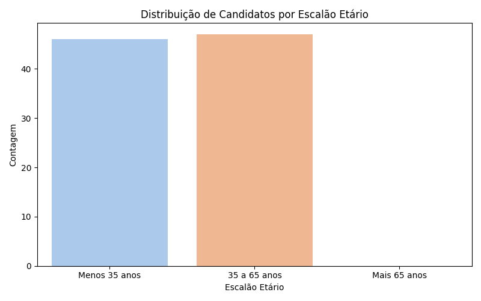
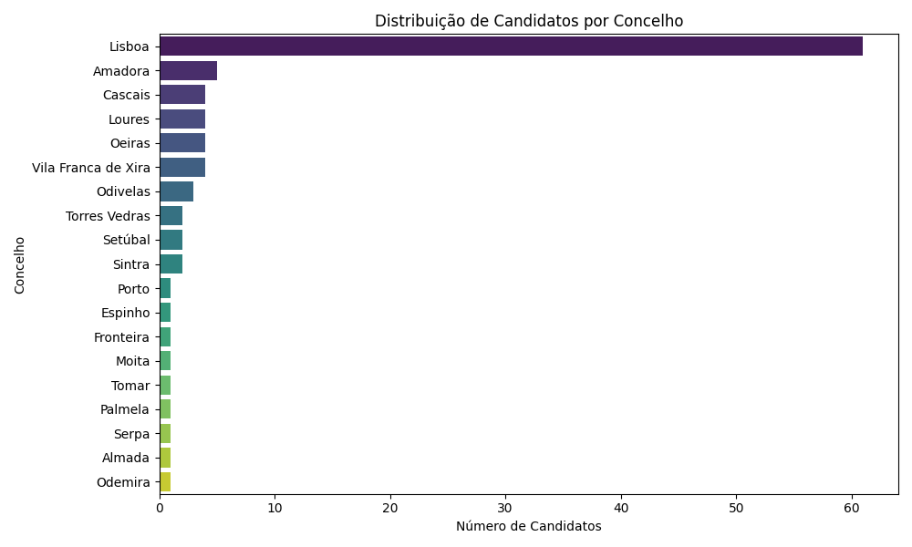
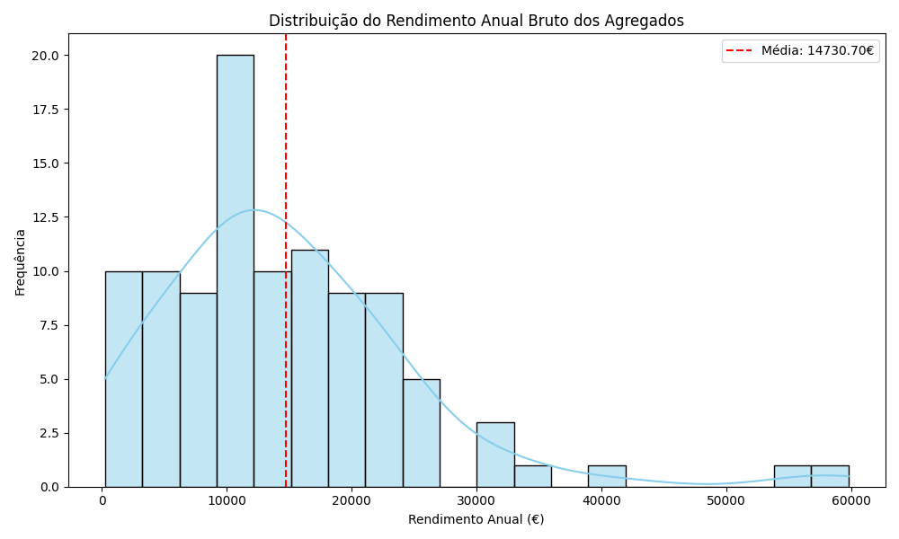

# Resumo Executivo - Milestone 1 (Iniciação)

Este documento sintetiza o trabalho realizado na fase de iniciação do projeto "Análise de Elegibilidade Habitacional", servindo de base para a validação do **Business Understanding** e **Data Understanding** com a equipa docente.

---

## 1. Definição do Problema (Business Understanding)
**Mudança de Estratégia (Pivot):** 
Abandonou-se a abordagem inicial de comparação com preços de mercado especulativos (Scraping/Idealista). O projeto foca-se agora, exclusivamente, na **Análise de Elegibilidade Institucional**.

**O Novo Objetivo:**
Desenvolver um "Auditor de Elegibilidade" que cruza os dados socioeconómicos dos candidatos com as regras oficiais (Decretos-Lei e Regulamentos Municipais), respondendo à pergunta:
> *"Qual a taxa de cobertura real dos apoios habitacionais (Porta 65, PRA, SMAA) para esta amostra de famílias?"*

---

## 2. Análise de Dados (Data Understanding)
A análise exploratória inicial (`notebooks/1.0_eda_inicial.ipynb`) sobre a amostra de 100 candidatos revelou padrões determinantes para a modelação futura.

### A. Validação de Dados e Qualidade
*   **Completude:** O dataset apresenta boa qualidade geral, sem valores nulos críticos nas variáveis chave (`Rendimento`, `Agregado`, `Idade`).
*   **Formato:** Identificada necessidade de limpeza na variável `Concelho` (normalização de strings) e conversão de `Escalão Etário` (categórico) para numérico.

### B. Insights Demográficos e Impacto nas Regras
A análise visual permitiu antecipar regras de negócio específicas:

#### 1. Distribuição Etária (Binária)
A amostra divide-se equitativamente entre Jovens (<35) e Adultos (>35).
*   **Implicação:** O algoritmo terá de processar o **Porta 65 Jovem** para metado da amostra e validar se o **Porta 65+** ou **PRA** cobrem a restante população.

#### 2. Geografia (O Filtro de Exclusão)
Apesar da designação "Lisboa", existem candidatos residentes em concelhos limítrofes (Odivelas, Amadora, Sintra).
*   **Implicação:** A regra de "Residência Fiscal no Concelho" será o primeiro nó de decisão para excluir candidatos dos programas municipais (PRA e SMAA).

#### 3. Rendimentos (A Curva da Classe Média)
A maioria dos agregados situa-se na faixa **10.000€ - 20.000€ / ano**.
*   **Implicação:** 
    *   Este segmento corre risco de exclusão dupla: rendimentos demasiado altos para Apoio Social direto, mas insuficientes para as taxas de esforço exigidas no mercado livre.
    *   O projeto irá focar-se em medir a eficácia dos apoios (Taxa de Esforço < 60%) exatamente para este segmento.

---

## 3. Entregáveis da Milestone 1
O repositório encontra-se estruturado conforme as boas práticas exigidas:

1.  **`docs/regras_programas_oficiais.md`:** Levantamento exaustivo da legislação (Porta 65, PRA, SMAA) com valores de referência (Teto Máximo, Taxas de Esforço).
2.  **`docs/M1_iniciacao.md`:** Planeamento estratégico com Objetivos SMART e Metodologia CRISP-DM.
3.  **`src/` & `notebooks/`:** Infraestrutura de código montada, com ambiente virtual e dependências (`requirements.txt`) definidas.
4.  **GitHub:** Organização profissional com Histórico de Commits descritivo e gestão de projeto via Issues.

---

## 4. Próximos Passos (Planeamento Milestone 2)
Ações imediatas para a fase de **Data Preparation**:

1.  **Feature Engineering:** 
    *   Converter `Escalão Etário` em `Idade Mínima` (int).
    *   Calcular `Rendimento Mensal` (Rendimento Global / 14).
    *   Derivar `Tipologia Máxima` baseada no `Nº Agregado` (Regra: T(N) ou T(N-1)).
2.  **Limpeza de Dados:** Script Python para normalização de nomes de concelhos (remoção de acentos e espaços extra).

---
*Documento preparado para a reunião de validação da Milestone 1 - [Data Atual]*
