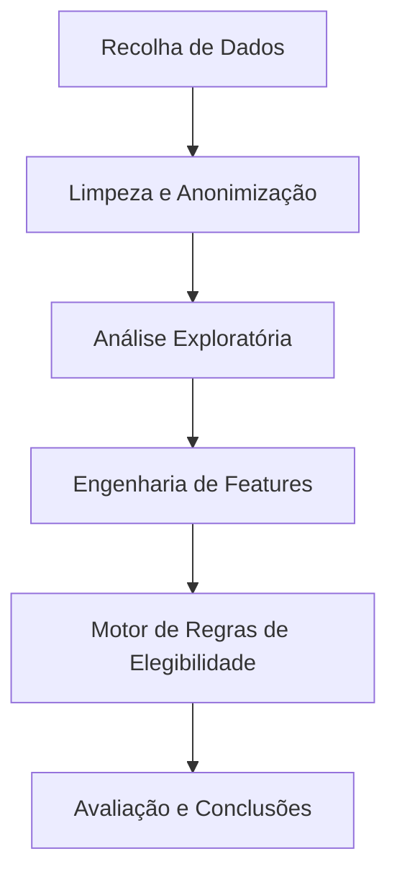

# Milestone 1: Iniciação e Entendimento do Negócio

## 1. Descrição do Problema

A crise habitacional em Lisboa afeta tanto jovens como famílias de classe média e baixa, que enfrentam graves dificuldades em encontrar habitação a preços compatíveis com os seus rendimentos.

* **Contexto:** O Município de Lisboa e o Governo disponibilizam vários programas de apoio habitacional (Porta 65 Jovem, Programa Renda Acessível, Subsídio Municipal ao Arrendamento Acessível), mas existe uma lacuna de informação sobre a real eficácia destes programas.
* **Problema Identificado:** Os programas de apoio existem, mas as suas regras de elegibilidade — rendimentos máximos, taxas de esforço, limites de idade, restrições geográficas — criam um **funil burocrático tão apertado** que uma parte significativa das pessoas que *precisam* de apoio fica automaticamente excluída, não por falta de necessidade, mas por excesso de burocracia ou por estar numa "zona cinzenta" de rendimentos.

### Pergunta Central do Projeto:
> **"Dada uma amostra de candidatos residentes (ou aspirantes a residentes) em Lisboa, qual a taxa de cobertura real dos atuais programas de apoio habitacional?"**

## 2. Objetivos SMART

*Objetivos definidos seguindo a lógica SMART (Específico, Mensurável, Atingível, Relevante e Temporal):*

1. **Objetivo 1 (Mapeamento de Regras):** Desenvolver um algoritmo capaz de replicar as regras de acesso dos 3 principais programas (Porta 65, PRA, SMAA) com 95% de precisão face à legislação, até à Milestone 3.
2. **Objetivo 2 (Taxa de Cobertura):** Quantificar, para a amostra fornecida, a percentagem de candidatos elegíveis para pelo menos um apoio habitacional e caracterizar os perfis "excluídos", até ao final do semestre.
3. **Objetivo 3 (Tipologia Familiar):** Identificar se as tipologias habitacionais disponíveis (T0–T4) são adequadas à dimensão dos agregados familiares candidatos da amostra.

### ✅ Auto-Correção (Checklist SMART)
- [x] **S (Específico):** O que vamos prever/analisar está claro? → Sim: Elegibilidade aos programas baseada em regras oficiais.
- [x] **M (Mensurável):** Definimos uma métrica? → Sim: Taxa de Cobertura (%) e Precisão das regras (95%).
- [x] **A (Atingível):** O nosso dataset permite isto? → Sim: Temos rendimentos, idade e agregado familiar.
- [x] **R (Relevante):** Este objetivo é central para o tema? → Sim: Responde diretamente à crise habitacional.
- [x] **T (Temporal):** Está associado a um Milestone/Data? → Sim: Prazos definidos por milestone.

## 3. Metodologia de Gestão (PBL)

* **Divisão de Tarefas:**
  * **Afonso Nunes:** Gestão do Repositório, Integração de Código e Coordenação.
  * **Duarte Ribeiro:** Responsável pela recolha e validação das Regras de Negócio (Legislação).
  * **Guilherme Ventura:** Responsável pela Análise Exploratória de Dados (EDA) e Visualização.
* **Ferramentas de Colaboração:** GitHub Projects para Kanban, reuniões semanais via Discord.

## 4. Entendimento dos Dados (Data Understanding)

### Fonte e Proveniência
* **Origem:** Dataset `amostras_desafio.xlsx` (anonimizado, fornecido pela CML via LxDataLab).
* **Período de Extração:** Dados disponibilizados no 1º semestre de 2025/2026.
* **Disponibilidade:** Dados descarregados e armazenados localmente (protegidos pelo `.gitignore`).
* **Qualidade Inicial:** Existem valores nulos em algumas colunas e os escalões etários estão em formato categórico, necessitando conversão na M2.
* **Ética:** Os dados cumprem o RGPD — estão anonimizados (sem nomes, moradas ou NIFs).

### Dicionário de Variáveis (Metadados)

| Variável | Tipo de Dado | Descrição | Importância Esperada |
| :--- | :--- | :--- | :--- |
| `Contexto` | Categórico | Tipo de candidatura (arrendamento, realojamento) | Média |
| `Estado` | Categórico | Estado atual do processo do candidato | Média |
| `Data Estado` | Data | Data da última atualização do estado | Baixa |
| `Escalão Etário` | Categórico | Faixa etária do candidato (< 35, 35-65, > 65 anos) | **Muito Alta** — define elegibilidade Porta 65 |
| `Nº Elem. Agregado` | Numérico | Número total de elementos do agregado familiar | **Alta** — define tipologia mínima (T0–T4) |
| `Nº Adultos` | Numérico | Número de adultos no agregado | **Alta** — cálculo de rendimento per capita |
| `Concelho` | Categórico | Município de residência do candidato | **Alta** — elegibilidade geográfica |
| `Rendimento Global` | Numérico (€) | Rendimento anual bruto do agregado | **Muito Alta** — taxa de esforço e limites |

## 5. Planeamento da Abordagem

### Perguntas de Investigação

1. **Qual é a taxa real de cobertura dos programas habitacionais (Porta 65, PRA, SMAA) para esta amostra de candidatos?**
2. **Quais são os principais fatores socioeconómicos (Rendimento vs. Dimensão do Agregado vs. Idade) que levam à exclusão dos candidatos?**
3. **Existe uma sobreposição significativa entre os públicos-alvo dos diferentes programas, ou eles servem segmentos distintos da população?**

### Diagrama de Processo

### Ferramentas e Tecnologias
* **Pandas:** Manipulação e limpeza dos dados tabulares.
* **Matplotlib / Seaborn:** Criação de gráficos estáticos para relatórios e EDA.
* **OpenPyXL:** Leitura e escrita de ficheiros Excel.
* **Jupyter Notebooks:** Ambiente de desenvolvimento interativo.
* **Git / GitHub:** Controlo de versões e gestão de projeto (Issues/Projects).

### Cronograma por Milestone

| Fase | Prazo | Entregável |
| :--- | :--- | :--- |
| **M1: Iniciação** | 26 Fev 2026 | Definição do problema, setup do repositório, dicionário de dados |
| **M2: Exploração** | Março 2026 | Limpeza de dados, EDA e visualizações |
| **M3: Modelação** | Abril 2026 | Motor de regras de elegibilidade e classificação |
| **M4: Finalização** | Maio 2026 | Dashboard, relatório final e recomendações |

---
*Data de última atualização: 20/02/2026*
