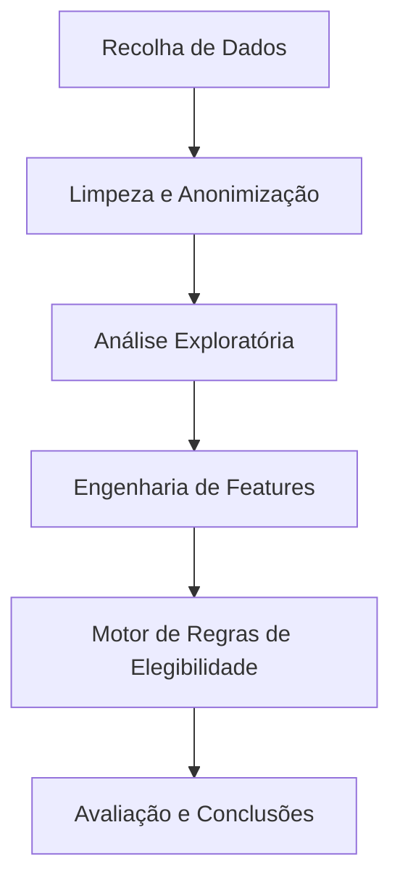

# Milestone 1: Iniciação e Entendimento do Negócio

## 1. Descrição do Problema

A crise habitacional em Lisboa afeta tanto jovens como famílias de classe média e baixa, que enfrentam graves dificuldades em encontrar habitação a preços compatíveis com os seus rendimentos.

* **Contexto:** O Município de Lisboa e o Governo disponibilizam vários programas de apoio habitacional (Porta 65 Jovem, Programa Renda Acessível, Subsídio Municipal ao Arrendamento Acessível), mas existe uma lacuna de informação sobre a real eficácia destes programas.
* **Problema Identificado:** Os programas de apoio existem, mas as suas regras de elegibilidade — rendimentos máximos, taxas de esforço, limites de idade, restrições geográficas — criam um **funil burocrático tão apertado** que uma parte significativa das pessoas que *precisam* de apoio fica automaticamente excluída, não por falta de necessidade, mas por excesso de burocracia ou por estar numa "zona cinzenta" de rendimentos.

### Pergunta Central do Projeto:
> **"Dada uma amostra de candidatos residentes (ou aspirantes a residentes) em Lisboa, qual a taxa de cobertura real dos atuais programas de apoio habitacional?"**

## 2. Objetivos SMART

*Objetivos definidos seguindo a lógica SMART (Específico, Mensurável, Atingível, Relevante e Temporal):*

1. **Objetivo 1 (Mapeamento de Regras):** Desenvolver um algoritmo capaz de replicar as regras de acesso dos 3 principais programas (Porta 65, PRA, SMAA) com 95% de precisão face à legislação, até à Milestone 3.
2. **Objetivo 2 (Taxa de Cobertura):** Quantificar, para a amostra fornecida, a percentagem de candidatos elegíveis para pelo menos um apoio habitacional e caracterizar os perfis "excluídos", até ao final do semestre.
3. **Objetivo 3 (Tipologia Familiar):** Identificar se as tipologias habitacionais disponíveis (T0–T4) são adequadas à dimensão dos agregados familiares candidatos da amostra.

### ✅ Auto-Correção (Checklist SMART)
- [x] **S (Específico):** O que vamos prever/analisar está claro? → Sim: Elegibilidade aos programas baseada em regras oficiais.
- [x] **M (Mensurável):** Definimos uma métrica? → Sim: Taxa de Cobertura (%) e Precisão das regras (95%).
- [x] **A (Atingível):** O nosso dataset permite isto? → Sim: Temos rendimentos, idade e agregado familiar.
- [x] **R (Relevante):** Este objetivo é central para o tema? → Sim: Responde diretamente à crise habitacional.
- [x] **T (Temporal):** Está associado a um Milestone/Data? → Sim: Prazos definidos por milestone.

## 3. Metodologia de Gestão (PBL)

* **Divisão de Tarefas:**
  * **Afonso Nunes:** Gestão do Repositório, Integração de Código e Coordenação.
  * **Duarte Ribeiro:** Responsável pela recolha e validação das Regras de Negócio (Legislação).
  * **Guilherme Ventura:** Responsável pela Análise Exploratória de Dados (EDA) e Visualização.
* **Ferramentas de Colaboração:** GitHub Projects para Kanban, reuniões semanais via Discord.

## 4. Entendimento dos Dados (Data Understanding)

### Fonte e Proveniência
* **Origem:** Dataset `amostras_desafio.xlsx` (anonimizado, fornecido pela CML via LxDataLab).
* **Período de Extração:** Dados disponibilizados no 1º semestre de 2025/2026.
* **Disponibilidade:** Dados descarregados e armazenados localmente (protegidos pelo `.gitignore`).
* **Qualidade Inicial:** Existem valores nulos em algumas colunas e os escalões etários estão em formato categórico, necessitando conversão na M2.
* **Ética:** Os dados cumprem o RGPD — estão anonimizados (sem nomes, moradas ou NIFs).

### Dicionário de Variáveis (Metadados)

| Variável | Tipo de Dado | Descrição | Importância Esperada |
| :--- | :--- | :--- | :--- |
| `Contexto` | Categórico | Tipo de candidatura (arrendamento, realojamento) | Média |
| `Estado` | Categórico | Estado atual do processo do candidato | Média |
| `Data Estado` | Data | Data da última atualização do estado | Baixa |
| `Escalão Etário` | Categórico | Faixa etária do candidato (< 35, 35-65, > 65 anos) | **Muito Alta** — define elegibilidade Porta 65 |
| `Nº Elem. Agregado` | Numérico | Número total de elementos do agregado familiar | **Alta** — define tipologia mínima (T0–T4) |
| `Nº Adultos` | Numérico | Número de adultos no agregado | **Alta** — cálculo de rendimento per capita |
| `Concelho` | Categórico | Município de residência do candidato | **Alta** — elegibilidade geográfica |
| `Rendimento Global` | Numérico (€) | Rendimento anual bruto do agregado | **Muito Alta** — taxa de esforço e limites |

## 5. Planeamento da Abordagem

### Perguntas de Investigação

1. **Qual é a taxa real de cobertura dos programas habitacionais (Porta 65, PRA, SMAA) para esta amostra de candidatos?**
2. **Quais são os principais fatores socioeconómicos (Rendimento vs. Dimensão do Agregado vs. Idade) que levam à exclusão dos candidatos?**
3. **Existe uma sobreposição significativa entre os públicos-alvo dos diferentes programas, ou eles servem segmentos distintos da população?**

### Diagrama de Processo

### Ferramentas e Tecnologias
* **Pandas:** Manipulação e limpeza dos dados tabulares.
* **Matplotlib / Seaborn:** Criação de gráficos estáticos para relatórios e EDA.
* **OpenPyXL:** Leitura e escrita de ficheiros Excel.
* **Jupyter Notebooks:** Ambiente de desenvolvimento interativo.
* **Git / GitHub:** Controlo de versões e gestão de projeto (Issues/Projects).

### Cronograma por Milestone

| Fase | Prazo | Entregável |
| :--- | :--- | :--- |
| **M1: Iniciação** | 26 Fev 2026 | Definição do problema, setup do repositório, dicionário de dados |
| **M2: Exploração** | Março 2026 | Limpeza de dados, EDA e visualizações |
| **M3: Modelação** | Abril 2026 | Motor de regras de elegibilidade e classificação |
| **M4: Finalização** | Maio 2026 | Dashboard, relatório final e recomendações |

## 6. Regras Oficiais dos Programas de Apoio à Habitação

Este conteúdo compila as regras técnicas de elegibilidade para os programas de habitação considerados no projeto, servindo de base para a implementação do motor de regras.

### 6.1. Porta 65 Jovem (Apoio Financeiro ao Arrendamento)
**Fonte:** Portaria n.º 277-A/2010 e Decreto-Lei n.º 42/2024.
**Objetivo:** Apoiar jovens no pagamento da renda de casa.

#### 📝 Critérios de Elegibilidade
- **Idade:**
  - Jovens isolados: **18 a 35 anos** (inclusive).
  - Casais: Um dos elementos pode ter até **36 anos**, desde que o outro tenha até 35.
- **Residência:** Titular de contrato de arrendamento para residência permanente (morada fiscal coincidente).
- **Rendimento (Teto Máximo Mensal):**
  - O rendimento mensal corrigido do agregado não pode exceder **4x** a Retribuição Mínima Mensal Garantida (RMMG).
  - RMMG 2024 (aprox): 820€.
  - Teto Máximo: **3.280€/mês** (brutos).
- **Taxa de Esforço:**
  - A soma dos rendimentos brutos deve ser compatível com uma taxa de esforço máxima de **60%** (Renda / Rendimento Bruto <= 0.6).
- **Tipologia Adequada (Máxima):**
  - 1 a 2 pessoas: Até **T2**.
  - 3 pessoas: Até **T3**.
  - 4 a 5 pessoas: Até **T4**.

#### ⚠️ Motivos de Exclusão Comuns
- Ser proprietário de outro imóvel.
- Ter dívidas a programas anteriores.
- Renda superior à **Renda Máxima de Referência** (RMR) definida por concelho.

### 6.2. Porta 65 + (Apoio a Quebra de Rendimentos)
**Fonte:** Linha 36 da Ficha de Caracterização / Portal da Habitação.
**Objetivo:** Apoiar famílias com quebra de rendimentos (>20%) ou monoparentais.

#### 📝 Critérios de Elegibilidade
- **Público Alvo:**
  - Pessoas com quebra de rendimentos superior a 20% face aos 3 meses anteriores ou ano homólogo.
  - Famílias Monoparentais.
- **Rendimento:**
  - Rendimento mensal corrigido não pode exceder **4x** o Salário Mínimo (~3.280€/mês).
- **Taxa de Esforço:**
  - Máxima de **60%**.
- **Limites de Renda:**
  - Aplicam-se os mesmos tetos máximos de renda (RMR) do Porta 65 Jovem.

### 6.3. Programa Renda Acessível - PRA (Câmara Municipal de Lisboa)
**Fonte:** Regulamento do Programa Renda Acessível (CML).
**Objetivo:** Disponibilizar casas com rendas inferiores ao mercado para a classe média.

#### 📝 Critérios de Elegibilidade
- **Rendimento Mínimo:**
  - O agregado deve ter capacidade financeira para pagar a renda.
  - Mínimo anual: **9.840€** (1 pessoa) ou aferido pela taxa de esforço mínima.
- **Rendimento Máximo (Anual Bruto):**
  - **1 pessoa:** Até **35.000€** (~2.500€/mês x 14).
  - **2 pessoas:** Até **45.000€** (~3.214€/mês x 14).
  - **+2 pessoas:** 45.000€ + **5.000€** por cada dependente adicional.
- **Taxa de Esforço Exigida:**
  - O valor da renda acessível deve representar entre **15% e 35%** do Rendimento Mensal Líquido (RML) do agregado.

#### ⚠️ Motivos de Exclusão Comuns
- Ser proprietário de imóvel na Área Metropolitana de Lisboa.
- Ter dívidas ao município ou finanças.

### 6.4. Subsídio Municipal ao Arrendamento Acessível (SMAA)
**Fonte:** Regulamento Municipal do Direito à Habitação (CML).
**Objetivo:** Apoio financeiro a famílias com carência económica e rendas elevadas.

#### 📝 Critérios de Elegibilidade
- **Residência:** Contrato de arrendamento em Lisboa.
- **Rendimento Global:**
  - Máximo de **35.000€/ano** (1 pessoa) ou **45.000€/ano** (2 pessoas).
- **Taxa de Esforço Atual:**
  - O agregado deve estar a gastar **mais de 30%** do seu rendimento líquido na renda atual.
- **Limites de Renda Aceites (Teto Máximo da Renda Atual):**
  - A renda que a família paga atualmente não pode ultrapassar:
    - **T0:** 600€
    - **T1:** 900€
    - **T2:** 1.150€
    - **T3:** 1.375€
    - **T4:** 1.550€

### 6.5. Nota sobre o Programa 1º Direito (Linha 37)
Embora listado na Ficha de Caracterização, o programa **1º Direito** destina-se a famílias que vivem em condições habitacionais indignas (precariedade, insalubridade, insegurança, sobrelotação).
Como o dataset fornecido (`amostras_desafio.xlsx`) **não contém informação sobre as condições físicas da habitação atual** dos candidatos, não é tecnicamente possível calcular a elegibilidade para este programa com rigor. Será excluído do algoritmo principal, focando-se a análise nos critérios financeiros e demográficos.

### 6.6. Resumo Comparativo para o Algoritmo

| Critério | Porta 65 Jovem | Porta 65 + | Renda Acessível (PRA) | SMAA (Subsídio) |
| :--- | :--- | :--- | :--- | :--- |
| **Idade** | 18-35 anos | Qualquer (foco quebra/monoparental) | > 18 anos | > 18 anos |
| **Rendimento Max** | ~3.280€/mês (Bruto) | ~3.280€/mês (Bruto) | 35k-45k/ano (Bruto) | 35k-45k/ano (Bruto) |
| **Fator Chave** | Jovens | Quebra Rendimento | Classe Média | Taxa de Esforço Elevada (>30%) |
| **Tipo de Apoio** | Financeiro | Financeiro | Casa com Renda Reduzida | Financeiro (Diferencial) |

---
*Data de última atualização: 20/02/2026*
