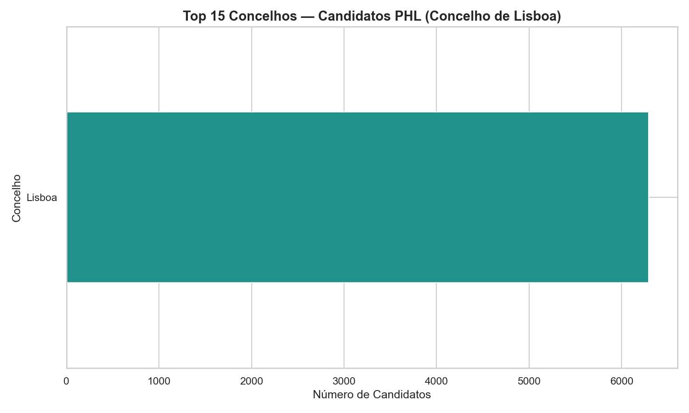
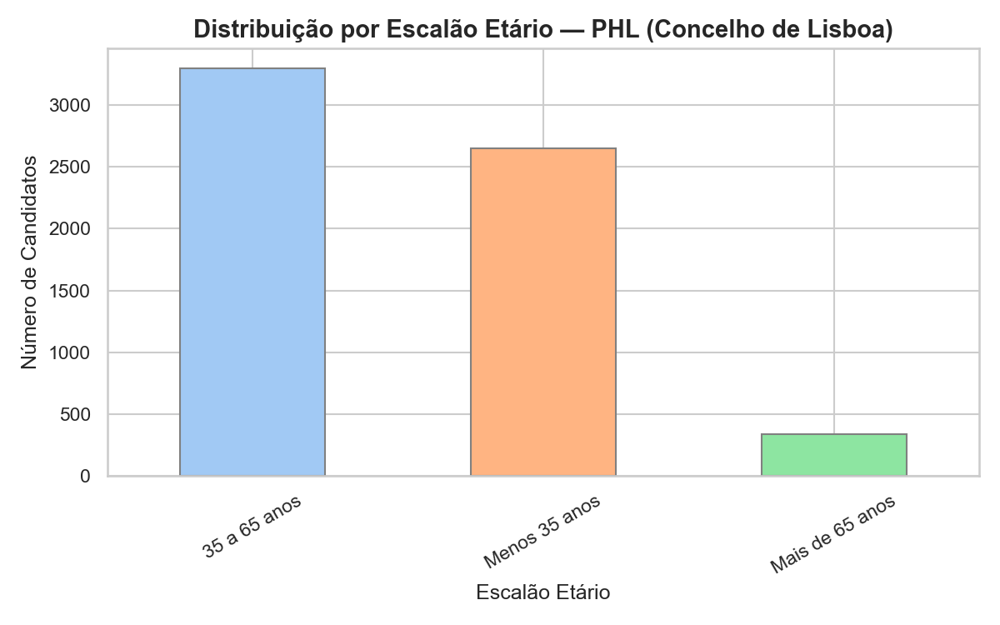
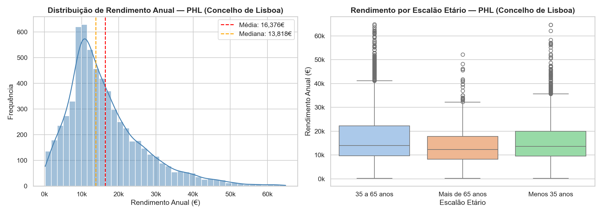
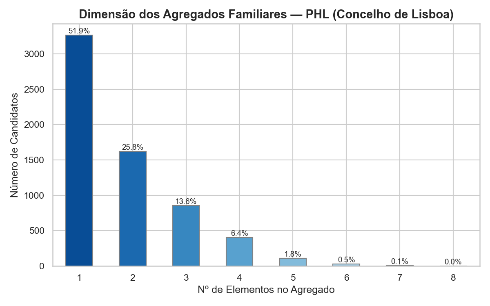
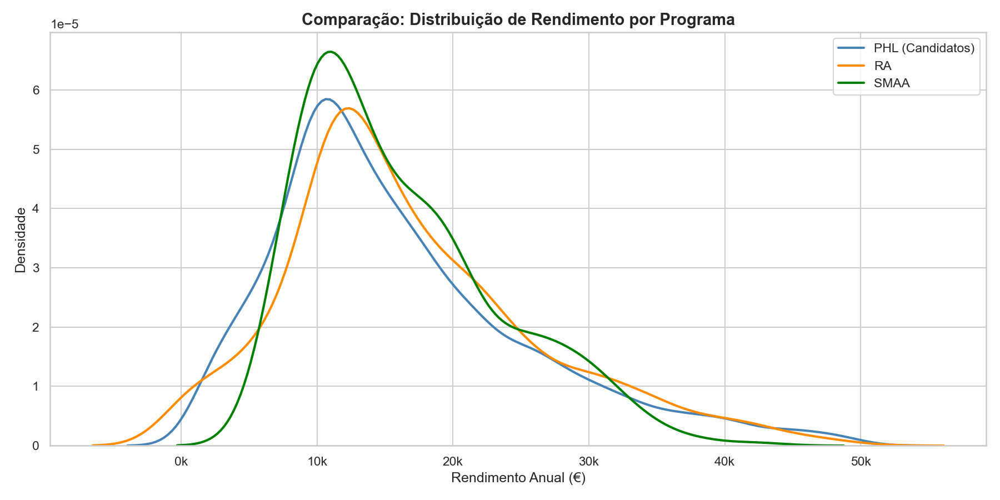
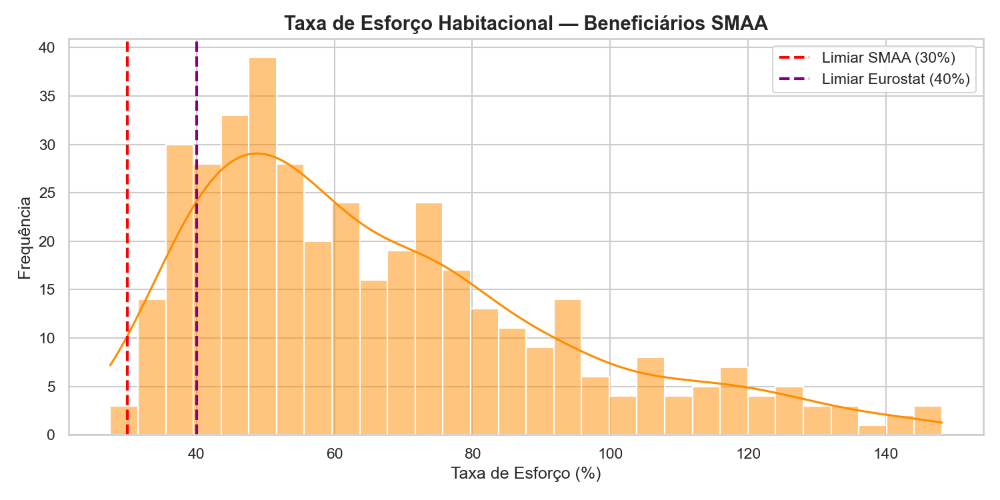
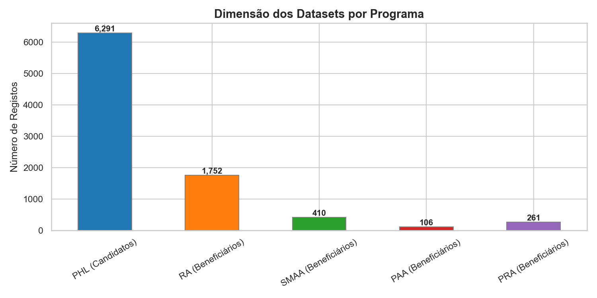

# Milestone 2: Exploração e Preparação de Dados

> **Estado:** ✅ Concluída — 12/03/2026
> **Foco CRISP-DM:** Data Understanding & Data Preparation

---

## Resumo Executivo

| Métrica | Valor |
|:---|:---:|
| Registos PHL (brutos) | 10.279 |
| Candidatos no concelho de Lisboa | **6.291 (61.2%)** |
| Rendimento médio (Lisboa) | **16.376 €/ano** |
| Rendimento mediano (Lisboa) | **13.818 €/ano** |
| Agregados de 1–2 pessoas | **77.6%** |
| Dataset unificado de beneficiários | **777** (SMAA: 410 \| PRA: 261 \| PAA: 106) |

> **Descoberta central:** O rendimento médio dos candidatos PHL (16.376€) é praticamente idêntico ao dos beneficiários SMAA (16.511€) e PRA (17.157€). A exclusão não é socioeconómica — é burocrática.

---

## 1. Objetivos da Fase

1. **Explorar** a distribuição das variáveis-chave do PHL e comparar com os datasets de beneficiários
2. **Limpar e preparar** os dados: tratar nulos, harmonizar variáveis, converter tipos
3. **Produzir visualizações** que descrevem o perfil dos candidatos
4. **Responder às Perguntas de Investigação I e II** (M1):
   - *Qual a distribuição de rendimentos, escalões etários e dimensão de agregados?*
   - *Qual a representação geográfica dos candidatos?*

---

## 2. Datasets Utilizados

| Dataset | Registos | Papel na M2 |
|:---|:---:|:---|
| **PHL — Plataforma Habitar Lisboa** | 10.279 | Dataset principal — base de toda a EDA |
| **RA — Renda Acessível** | amostra 10% | Comparação de perfil |
| **SMAA Ed.6** | 410 | Beneficiários reais — validação e comparação |
| **PAA 2024** | 106 | Beneficiários reais — validação e comparação |
| **PRA Ed.21/22/25** | 261 | Beneficiários reais — validação e comparação |

---

## 3. Limpeza e Preparação de Dados

### 3.1 Normalização de Colunas

Todos os nomes de colunas foram convertidos para `snake_case`:

| Original | Normalizado |
|:---|:---|
| `Escalão Etário` | `escalao_etario` |
| `Nº Elem. Agregado` | `n_elem_agregado` |
| `Rendimento Global (IRS e Rend. Isentos)` | `rendimento_global_anual` |
| `Rend_Mensal_Atual_Agreg` | `rend_mensal_atual` |
| `Encargos_habitacao` | `encargos_habitacao` |

### 3.2 Tratamento de Valores Nulos

**Política:** Conservadora — registos com variáveis críticas nulas são excluídos da análise de elegibilidade.

| Variável | Estratégia |
|:---|:---|
| `rendimento_global_anual` nulo | Excluir do cálculo de elegibilidade |
| `escalao_etario` nulo | Excluir do cálculo do Porta 65 |
| `n_elem_agregado` nulo | Assumir 1 elemento (conservador) |
| `concelho` nulo | Não elegível para critérios geográficos |
| `encargos_habitacao` = "-" | Converter para `NaN` |

### 3.3 Engenharia de Variáveis

| Variável | Transformação | Motivo |
|:---|:---|:---|
| `escalao_etario` (categórico) | Mapeado: "Menos 35 anos" → **26**, "35–65 anos" → **50**, "Mais 65 anos" → **70** | Verificar barreira dos 35 anos (Porta 65) |
| `rendimento_global_anual` | Dividido por 14 → `rend_mensal_bruto` | Comparar com tetos mensais |
| `encargos` / `rend_mensal` | `taxa_esforco = encargos / rend_mensal × 100` | Critério SMAA (> 30%) |
| `concelho` | Flag `is_residente_lisboa` — filtrar `True` | Restringir ao âmbito do projeto |

### 3.4 Dataset Unificado de Beneficiários

Os 3 datasets de beneficiários (SMAA, PAA, PRA) foram concatenados num único dataframe com colunas harmonizadas para análise comparativa direta com o PHL.

---

## 4. Análise Exploratória de Dados (EDA)

### 4.1 Distribuição Geográfica

- **61.2%** dos candidatos residem no **concelho de Lisboa** (6.291 registos) — base da análise
- **38.8%** residem noutros concelhos (AML e outros) — excluídos do âmbito
- Os programas PRA e SMAA exigem residência no **concelho de Lisboa** (não basta o distrito) — barreira geográfica imediata

### 4.2 Distribuição por Escalão Etário

- O PHL usa 3 categorias etárias: "Menos 35 anos", "35 a 65 anos", "Mais de 65 anos"
- **41.8%** dos candidatos de Lisboa têm menos de 35 anos — potencialmente elegíveis para Porta 65 Jovem
- A granularidade limitada introduz imprecisão no limite dos 35 anos

### 4.3 Distribuição de Rendimentos

- Distribuição com **assimetria positiva** (cauda longa à direita)
- Rendimento médio: **16.376 €/ano** | Mediana: **13.818 €/ano**
- "Zona cinzenta" visível entre 20.000–45.000€/ano: acima dos tetos PAA mas potencialmente dentro dos tetos PRA/SMAA

### 4.4 Distribuição por Dimensão do Agregado

- **77.6%** dos candidatos têm agregados de **1–2 pessoas** (tipologia T0/T1/T2)
- Minoria com 4+ pessoas necessita de T3/T4 — oferta municipal mais escassa

### 4.5 Comparação Candidatos PHL vs. Beneficiários Reais

| | Candidatos PHL (Lisboa) | SMAA | PRA | PAA |
|:---|:---:|:---:|:---:|:---:|
| Rendimento médio (€/ano) | **16.376** | **16.511** | **17.157** | **3.065** |
| Rendimento mediano (€/ano) | 13.818 | — | — | — |

> 🔑 **Descoberta central:** Os candidatos PHL têm perfil de rendimento **estatisticamente semelhante** aos beneficiários SMAA e PRA. A exclusão não é explicada por diferenças socioeconómicas — é causada por critérios formais (taxa de esforço, tipologia, situação habitacional). O PAA serve um segmento claramente distinto (vulnerabilidade extrema, 3.065€/ano).

### 4.6 Taxa de Esforço dos Beneficiários SMAA

- **Taxa de esforço calculada** para beneficiários SMAA (têm encargos de habitação)
- Distribuição confirma critério de entrada: mediana **60.1%**, 99.7% com taxa > 30%
- **O PHL não contém encargos habitacionais** — taxa de esforço dos candidatos não calculável; esta limitação impacta diretamente o motor SMAA na M3

### 4.7 Dimensão dos Datasets

Visão comparativa do volume de cada dataset utilizado no projeto.

---

## 5. Relatório de Limpeza

| Métrica | Valor |
|:---|:---:|
| Registos PHL brutos | 10.279 |
| Registos excluídos — `rendimento_global_anual` nulo | **0** |
| Registos excluídos — fora do concelho de Lisboa | **3.988 (38.8%)** |
| **Candidatos do concelho de Lisboa (base de análise)** | **6.291 (61.2%)** |
| Agregados de 1–2 pessoas | 77.6% |
| Dataset unificado de beneficiários | 777 (SMAA: 410 \| PRA: 261 \| PAA: 106) |

---

## 6. Conclusões

### 6.1 Síntese por Dimensão

**Distribuição Geográfica:** 38.8% dos candidatos PHL residem fora de Lisboa e são excluídos do âmbito — os programas PRA e SMAA exigem residência no concelho de Lisboa.

**Rendimentos:** Assimetria positiva com média 16.376€ e mediana 13.818€. Perfil de classe média-baixa, bem dentro dos tetos dos programas (35.000–45.000€).

**Distribuição Etária:** 41.8% têm menos de 35 anos (candidatos ao Porta 65). Granularidade limitada das categorias etárias introduz imprecisão no limite dos 35 anos.

**Dimensão do Agregado:** 77.6% com 1–2 pessoas — procura concentrada em tipologias T0/T1/T2.

**Candidatos vs. Beneficiários:** Perfis socioeconómicos semelhantes — a exclusão é formal, não socioeconómica.

### 6.2 Limitações e Impacto na M3

| Limitação | Impacto no Motor de Regras (M3) |
|:---|:---|
| `escalao_etario` categórico | Imprecisão ±5 anos no limite dos 35 anos (Porta 65) |
| Sem `encargos_habitacao` no PHL | Critério SMAA (taxa esforço > 30%) não calculável — motor dará limite superior |
| Critérios não observáveis (imóvel próprio, dívidas) | Taxa de cobertura calculada em M3 será **limite superior** da elegibilidade real |
| 38.8% fora de Lisboa | Excluídos do âmbito — análise incide sobre 6.291 candidatos |

---

*Data de última atualização: 20/03/2026*
