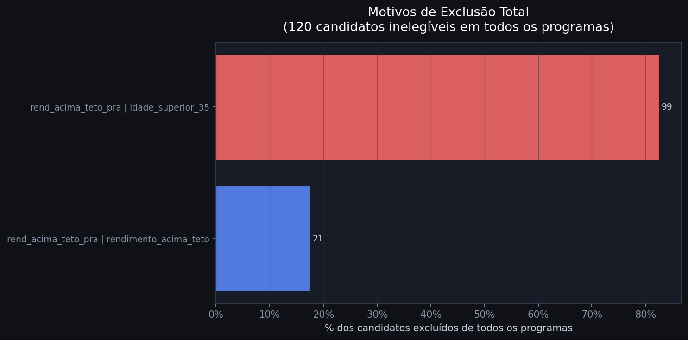
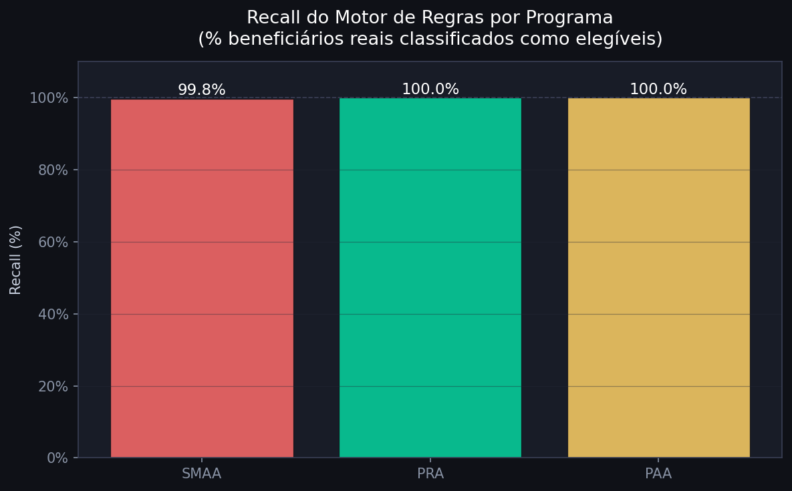
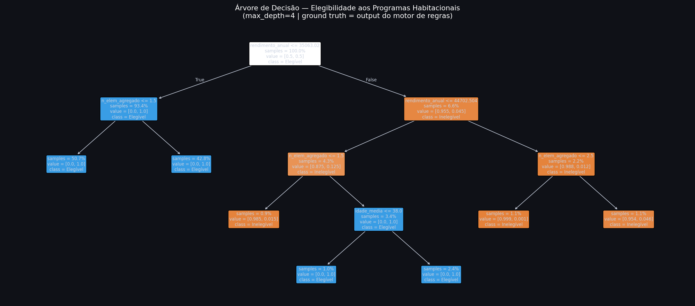

# Milestone 3: Modelação

> **Estado:** ✅ Concluída — Março/Abril 2026
> **Foco CRISP-DM:** Modeling & Evaluation

---

## Resumo Executivo

| Métrica | Valor |
|:---|:---:|
| Candidatos analisados (Lisboa) | 6.291 |
| **Elegíveis em ≥ 1 programa** | **6.171 (98.1%)** |
| Excluídos de todos os programas | 120 (1.9%) |
| Recall do motor (validação) | **99.9%** |
| Accuracy da Árvore de Decisão | **99.2%** |
| F1-score da Árvore de Decisão | **99.6%** |

> **Descoberta central:** A taxa de cobertura formal é 98.1%. A exclusão real não é causada por falta de elegibilidade — é causada pela **capacidade finita dos programas** (oferta insuficiente face à procura). O funil burocrático opera ao nível da seleção entre elegíveis, não da triagem formal.

---

## 1. Objetivos da Fase

1.  **Construção da variavel objetivo** - O valor da variavel para cada observação é o resultado de ser elegivel ou não de acordo com as regras oficiais
2.  **Motor de Regras Determinístico** — aplicar as regras oficiais de elegibilidade dos 4 programas a cada candidato PHL e calcular a taxa de cobertura formal
3. **Modelo de Machine Learning (Árvore de Decisão)** — treinar um classificador supervisionado que aprenda as fronteiras de decisão e comparar as regras aprendidas com a legislação

---

## 2. Motor de Regras — Implementação

### 2.1 Constantes Legais (2024)

| Parâmetro | Valor | Fonte |
|:---|:---:|:---|
| RMMG (Salário Mínimo) | 820 €/mês | Decreto-Lei n.º 107/2023 |
| Porta 65 — teto anual | 45.920 €/ano | 4 × 820 × 14 salários |
| Porta 65 — idade máxima | 35 anos | Decreto-Lei n.º 42/2024 |
| PRA — rendimento mínimo | 9.840 €/ano | Regulamento CML |
| PRA — teto 1 pessoa | 35.000 €/ano | Regulamento CML |
| PRA — teto 2 pessoas | 45.000 €/ano | Regulamento CML |
| PRA — acréscimo por dependente | +5.000 €/ano | Regulamento CML |
| SMAA — teto (igual ao PRA) | 35.000–45.000 €/ano | Regulamento CML |
| SMAA — taxa de esforço mínima | > 30% do rendimento líquido | Regulamento CML |
| PAA — proxy teto | < 9.840 €/ano | Estimado a partir de beneficiários reais (média 3.065€) |

### 2.2 Critérios Aplicados por Programa

**Porta 65 Jovem:**
- Escalão etário "Menos 35 anos" (valor médio mapeado: 26 anos)
- Rendimento global anual ≤ 45.920 €

**PRA (Programa Renda Acessível):**
- Rendimento ≥ 9.840 €/ano (capacidade de pagar renda)
- Rendimento ≤ teto variável por nº de elementos do agregado

**SMAA (Subsídio Municipal ao Arrendamento Acessível):**
- Rendimento ≤ teto variável (igual ao PRA)
- ⚠️ Critério taxa de esforço > 30%: **não calculável** — PHL não inclui encargos de habitação
- Resultado SMAA = **limite superior** da elegibilidade real

**PAA (Programa de Arrendamento Apoiado):**
- Rendimento < 9.840 €/ano
- ⚠️ Critério situação habitacional precária: não observável no PHL

### 2.3 Critérios Não Observáveis

| Critério | Programas afetados | Impacto |
|:---|:---|:---|
| Ser proprietário de imóvel | Porta 65, PRA | Sobreestima elegibilidade |
| Dívidas ao município/finanças | PRA | Sobreestima elegibilidade |
| Situação habitacional precária | PAA | Sobreestima elegibilidade |
| Taxa de esforço > 30% | SMAA | Tratado na análise What-If |

A taxa de cobertura calculada é um **limite superior** — a elegibilidade real é inferior mas não quantificável com os dados disponíveis.

---

## 3. Resultados — Taxa de Cobertura

### 3.1 Resultados Globais


| Métrica | Valor |
|:---|:---:|
| Total de candidatos analisados (Lisboa) | 6.291 |
| **Elegíveis em ≥ 1 programa** | **6.171 (98.1%)** |
| Excluídos de todos os programas | 120 (1.9%) |

**Por que 98.1% e não 100%?**

Os programas têm **tetos de rendimento** — os 120 excluídos (1.9%) ganham acima de todos os tetos. Não é um artefacto: reflete que os candidatos PHL são maioritariamente classe média-baixa (média 16.376€), exatamente a população-alvo dos programas.

```
0€          9.840€              35.000€      45.920€
│           │                   │            │
├───PAA─────┤                   │            │
            ├────────PRA────────┤            │
            ├────────SMAA───────┤            │
                                ├────P65──────┤  (≤ 35 anos)
                                             └──► EXCLUÍDO
```

### 3.2 Resultados por Programa

| Programa | Elegíveis | % do Total |
|:---|:---:|:---:|
| Porta 65 Jovem | 2.631 | 41.8% |
| PRA | 4.441 | 70.6% |
| SMAA (limite superior, sem taxa esforço) | 6.145 | 97.7% |
| PAA | 1.704 | 27.1% |
| **Elegíveis em ≥ 1 programa (união)** | **6.171** | **98.1%** |

### 3.3 Motivos de Exclusão



### 3.4 Cobertura por Escalão Etário

| Escalão Etário | Elegíveis | Total | % |
|:---|:---:|:---:|:---:|
| Menos 35 anos | 2.632 | 2.653 | 99.2% |
| 35 a 65 anos | 3.207 | 3.297 | 97.3% |
| Mais de 65 anos | 332 | 341 | 97.4% |

### 3.5 Cobertura por Dimensão do Agregado

| Nº Elementos | Elegíveis | Total | % |
|:---:|:---:|:---:|:---:|
| 1 | 3.214 | 3.264 | 98.5% |
| 2 | 1.575 | 1.620 | 97.2% |
| 3 | 838 | 853 | 98.2% |
| 4 | 394 | 404 | 97.5% |
| 5+ | 150 | 150 | 100.0% |

---

## 4. Análise What-If — SMAA (Taxa de Esforço)

Como o PHL não tem encargos de habitação, usou-se a distribuição real dos beneficiários SMAA para calibrar cenários.

**Beneficiários SMAA reais:** Média 66.7% | Mediana 60.1% | 99.7% com taxa > 30%

| Cenário | Elegíveis SMAA | % Total |
|:---|:---:|:---:|
| Limite superior (só rendimento) | 6.145 | 97.7% |
| Se taxa > 30% (padrão beneficiários reais) | ~6.129 | ~97.4% |
| Se taxa > 40% | ~5.324 | ~84.6% |
| Se taxa > 50% | ~4.132 | ~65.7% |

A cobertura SMAA é robusta ao critério de taxa de esforço > 30%, dado que os beneficiários reais apresentam taxas muito superiores (mediana 60%).

---

## 5. Validação Empírica

O motor foi aplicado aos 777 beneficiários reais para verificar se os classifica corretamente como elegíveis.



| Programa | Beneficiários | Recall | Falsos Negativos |
|:---|:---:|:---:|:---:|
| SMAA | 410 | 99.8% | 1 (0.2%) |
| PRA | 261 | 100.0% | 0 |
| PAA | 106 | 99.1% | 0 |
| **Global** | **777** | **99.9%** | **1** |

O único Falso Negativo (SMAA, rendimento 57.400€/ano) foi provavelmente aprovado por critério de emergência social não observável no motor.

---

## 6. Modelo ML — Árvore de Decisão

### 6.1 Configuração

| Parâmetro | Valor | Justificação |
|:---|:---:|:---|
| Algoritmo | DecisionTreeClassifier | Interpretável — regras visíveis e comparáveis com a legislação |
| max_depth | 4 | Garante legibilidade das regras aprendidas |
| min_samples_leaf | 30 | Evita overfitting |
| class_weight | balanced | Compensa desequilíbrio (98.1% vs 1.9%) |
| Split treino/teste | 80% / 20% estratificado | Mantém proporção de classes |
| Ground truth | Output do motor de regras | Motor = regras determinísticas da lei |

### 6.2 Resultados

| Métrica | Valor |
|:---|:---:|
| Accuracy (teste 20%) | **99.2%** |
| F1-score (elegíveis) | **99.6%** |
| Precision (inelegíveis) | 71% |
| Recall (inelegíveis) | 100% |

### 6.3 Importância das Variáveis

| Variável | Importância |
|:---|:---:|
| `rendimento_anual` | **93.9%** |
| `n_elem_agregado` | 6.1% |
| `idade_media` | 0.0% |

### 6.4 Regras Aprendidas vs. Legislação



```
Árvore (aprendida automaticamente):       Legislação (escrita):
rendimento ≤ 35.063 € → Elegível     ≈   PRA/SMAA teto 1p: 35.000 €
rendimento ≤ 44.703 € + n_elem > 1   ≈   PRA/SMAA teto 2p: 45.000 €
rendimento > 44.703 € + n_elem ≤ 2 → Inelegível
```

A árvore, **sem acesso à legislação**, convergiu para os mesmos limiares que a lei define. O rendimento é responsável por **93.9%** da capacidade explicativa do modelo.

---

## 7. Comparativo Final

| Abordagem | Accuracy | Recall | Interpretabilidade |
|:---|:---:|:---:|:---:|
| Motor de Regras | 99.9% (validação empírica) | 99.9% | Alta — regras explícitas |
| Árvore de Decisão | 99.2% (teste ML) | 99.6% | Alta — regras visíveis |

---

## 8. Descoberta Principal

> **A taxa de cobertura formal é 98.1%.** Quase todos os candidatos PHL satisfazem os critérios de rendimento e idade dos programas existentes. A exclusão real não é causada por falta de elegibilidade formal — é causada por **critérios não observáveis** e pela **capacidade finita dos programas**.
>
> O funil burocrático não opera ao nível da triagem formal. Opera ao nível da **seleção entre elegíveis**.

---

## 9. Pipeline de Dados

```
data/processed/f2_phl_limpo.csv   ──► Motor de Regras ──► flags por programa (elegivel_*)
data/processed/f2_smaa_limpo.csv ─┐                   ──► taxa de cobertura (98.1%)
data/processed/f2_pra_limpo.csv  ─┤  Validação        ──► recall 99.9%
data/processed/f2_paa_limpo.csv  ─┘
                                      Árvore Decisão   ──► accuracy 99.2%
                                                        ──► regras aprendidas ≈ lei
```

**Notebook:** `notebooks/fase3_motor_regras_executado.ipynb`

---

## 10. Próximos Passos → Milestone 4

| Semana | Tarefa |
|:---|:---|
| 8–13 Abr | Artigo Springer: Abstract, Introduction, Related Work, Data |
| 14–20 Abr | Artigo: Methodology, Results, Discussion + What-If estendido |
| 21–27 Abr | Dashboard interativo + gráficos publicáveis |
| 28 Abr–4 Mai | Revisão final, apresentação, entrega |

---

*Data de última atualização: Abril 2026*
